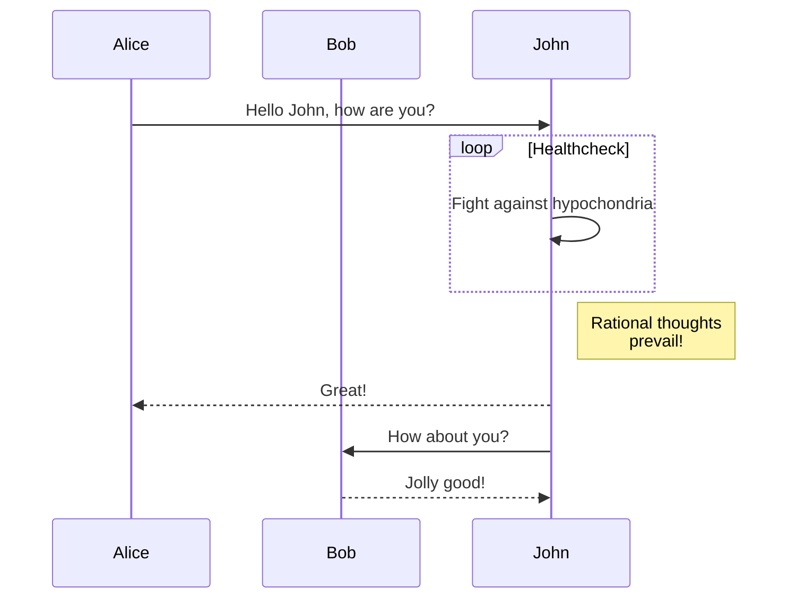

+++
date = '2025-11-23T21:37:59+01:00'
draft = false
title = 'My mermaid test'
+++

Hello Welt

> [!NOTE]
> Useful information that users should know, even when skimming content.

| First Header  | Second Header |
| ------------- | ------------- |
| Content Cell  | Content Cell  |
| Content Cell  | Content Cell  |